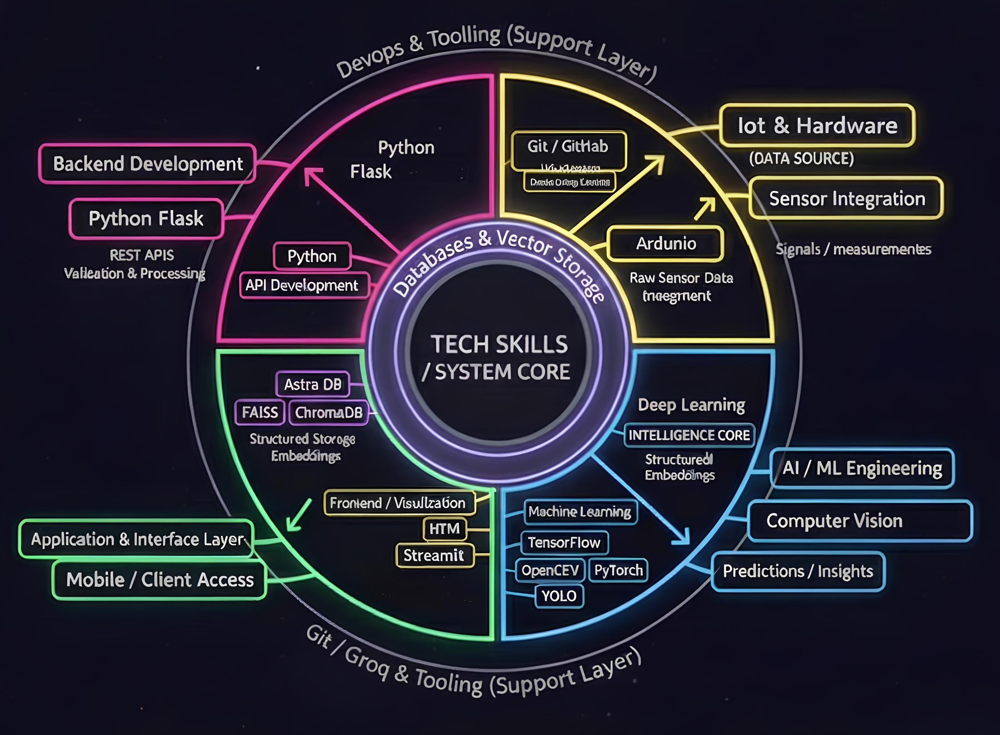

  

    

  

    

  

 

---

## 🧠 About Me

Hi, I’m **Rohit Sharma**, a passionate developer focused on **AI, Machine Learning**, and **Full-Stack Development**.  
I enjoy turning ideas into intelligent systems — from **LLM-powered chatbots** to **vision-driven AI tools**.

### 🧩 What I Build
- 🤖 **AI-Driven Interfaces:** Virtual Mouse, Facial Landmark Detection  
- 💬 **Chatbots & RAG Systems:** LangChain, Groq, Ollama, LLaMA-based assistants  
- 📊 **Data Science Projects:** Disease prediction, loan approval, IPL prediction  
- 🎥 **Content Intelligence:** LLM-based summarizers & topic analyzers  
- 🎯 **Computer Vision:** YOLOv8 object detection, face recognition, tracking  
- 🧮 **ML Apps:** Movie recommender, gold price predictor, fake news detector  

---

## 🧰 Core Skills Ecosystem

  
   
  Tech Stack Overview (Click to expand)

 

| 💻 Languages | 🏗️ Frameworks | 🛠️ Tools | 🧠 Concepts |
|:-----------:|:-------------:|:--------:|:-----------:|
| **Python 🐍**   C++   JavaScript | **OpenCV**   LangChain   Streamlit   scikit-learn | **Hugging Face**   Ollama   Groq   Mediapipe | **LLM Apps**   RAG Architecture   Computer Vision   NLP & EDA |

---

## 🚀 My Philosophy

  <i>“AI isn’t about replacing humans — it’s about amplifying what’s possible.”</i>

I’m driven by curiosity and a strong belief in **learning by building**.  
Every project I create is a step toward systems that are **intelligent, practical, and impactful**.

---

## 🌐 Connect With Me

 

  

