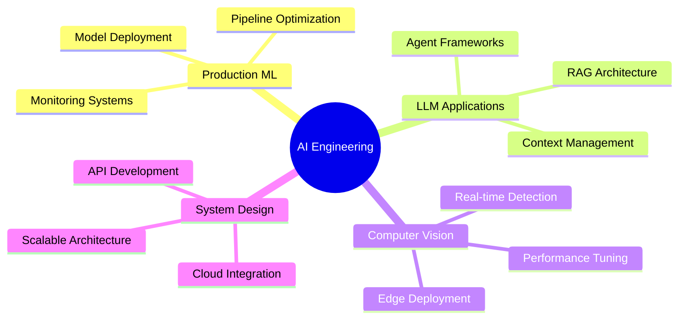

<div align="center">

<!-- Dynamic 3D Header -->


<br>

<!-- Animated Tech Role Carousel -->
<a href="https://git.io/typing-svg">
  
</a>

<br><br>

<!-- Social Links with Custom Styling -->
<p align="center">
  <a href="https://www.rohit.monster/">
    
  </a>
  <a href="mailto:randomrohit002@gmail.com">
    
  </a>
  <a href="https://www.linkedin.com/in/rohit-sharma-441b20297">
    
  </a>
</p>

<br>

<!-- Animated Stats Bar -->


</div>

<br>

---

<br>

<!-- Bio Section with Gradient Design -->
<div align="center">

### 『 🎯 Mission Statement 』

<table>
<tr>
<td width="60%">

```yaml
engineer:
  name: Rohit Sharma
  role: AI & Machine Learning Engineer
  education: Computer Science Undergraduate
  focus: Applied AI + Production Systems
  
philosophy:
  - "Ship code that survives contact with reality"
  - "Optimize for reliability, not just accuracy"
  - "Bridge the gap between research and production"
  
current_work:
  - Engineering robust ML pipelines
  - Building LLM-powered applications
  - Computer vision systems at scale
```

</td>
<td width="40%">


</td>
</tr>
</table>

</div>

<br>

---

<br>

<!-- Tech Stack Showcase -->
<div align="center">

## 🛠️ Technology Arsenal


</div>

<br>

<!-- Detailed Tech Breakdown -->
<table align="center">
<tr>
<td width="50%" valign="top">

### 🤖 AI & Machine Learning
```python
core_frameworks = [
    "PyTorch",      # Deep Learning
    "scikit-learn", # Classical ML
    "OpenCV",       # Computer Vision
    "YOLO v8/v11",  # Object Detection
]

llm_engineering = [
    "LangChain",    # LLM Orchestration
    "RAG Systems",  # Retrieval-Augmented
    "Groq/Ollama",  # Inference Engines
    "Vector DBs",   # Semantic Search
]
```

</td>
<td width="50%" valign="top">

### 💻 Engineering & Systems
```javascript
backend_stack = {
  languages: ["Python", "C++", "JavaScript"],
  frameworks: ["FastAPI", "Streamlit", "Flask"],
  databases: ["PostgreSQL", "MongoDB", "ChromaDB"],
  deployment: ["Docker", "Linux", "REST APIs"]
}

specializations = [
  "Real-time inference pipelines",
  "Model optimization & deployment",
  "System design & architecture"
]
```

</td>
</tr>
</table>

<br>

---

<br>

<!-- Project Domains -->
<div align="center">

## 🎨 Domain Expertise

</div>

<table align="center">
<tr>
<td width="25%" align="center">


### 🎯 Computer Vision
Real-time detection<br>
Pose estimation<br>
Image processing<br>
OCR systems

</td>
<td width="25%" align="center">


### 💬 NLP & LLMs
Chatbot architecture<br>
RAG pipelines<br>
Document intelligence<br>
Context-aware AI

</td>
<td width="25%" align="center">


### 📊 Predictive Analytics
Healthcare modeling<br>
Sports analytics<br>
Time series<br>
Feature engineering

</td>
<td width="25%" align="center">


### 🖥️ Interactive AI
Gesture control<br>
Facial tracking<br>
AR/VR integration<br>
Vision interfaces

</td>
</tr>
</table>

<br>

---

<br>


---

<br>

<!-- Philosophy Section with Custom Design -->
<div align="center">

## 🧠 Engineering Principles

<table>
<tr>
<td align="center" width="33%">

### 🎯 Reliability First
*Accuracy impresses in demos.<br>Reliability earns trust in production.*

Build systems that work<br>consistently, not occasionally.

</td>
<td align="center" width="33%">

### 🔍 Transparent AI
*Black boxes belong in labs,<br>not in production systems.*

Ensure explainable decisions<br>and interpretable outputs.

</td>
<td align="center" width="33%">

### ⚡ Performance Matters
*Speed is a feature.<br>Optimization is engineering.*

Design for scalability<br>from day one.

</td>
</tr>
</table>

</div>

<br>

---

<br>

<!-- Skills Visualization -->
<div align="center">

## 🎓 Skill Proficiency Map

<!-- Visual Skill Map -->
<a href="https://github.com/RandomRohit-hub/RandomRohit-hub/blob/main/image/MAP.jpeg">
  
</a>

<br><br>

<!-- Skill Progress Bars -->
| Skill Domain | Proficiency |
|:-------------|:------------|
| **Machine Learning & AI** |  |
| **Computer Vision** |  |
| **LLM Engineering** |  |
| **Full-Stack Development** |  |
| **System Architecture** |  |

</div>

<br>

---

<br>

<!-- Current Focus -->
<div align="center">

## 🚀 Current Focus Areas



</div>

<br>

---

<br>

<!-- Connect Section with Style -->
<div align="center">

## 🤝 Let's Build Together


<br>

**Open to collaborating on projects that push the boundaries of AI engineering.**

<br>

<!-- Contact Buttons -->
<a href="https://www.rohit.monster/">
  
</a>
&nbsp;&nbsp;
<a href="mailto:randomrohit002@gmail.com">
  
</a>
&nbsp;&nbsp;
<a href="https://www.linkedin.com/in/rohit-sharma-441b20297">
  
</a>

<br><br>

<!-- Quote Section -->


<br><br>

<!-- Footer Wave -->


</div>
