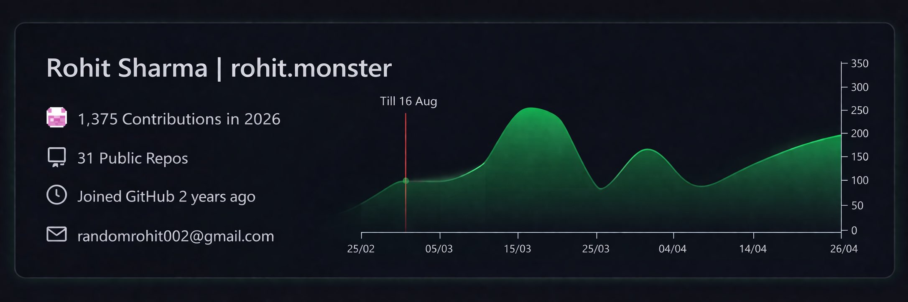

rohit / README.md

I am a software developer. I build things that combine AI, data, and real-world usability. Most of my work revolves around creating practical applications — systems that don’t just work, but scale.

Sometimes I spend time debugging things that break for no reason at all… which happens more often than I’d like to admit.

In my free time, I usually work on side projects or explore new areas like generative AI, RAG systems, and cloud technologies. Occasionally, I step away from the screen and just take a walk to clear my head.

I enjoy building things that feel meaningful — whether it's analyzing data, designing systems, or experimenting with new ideas.

---

## Rohit's GitHub Stats

  

---

  

---

*Last updated automatically — still building, still improving ✨*
